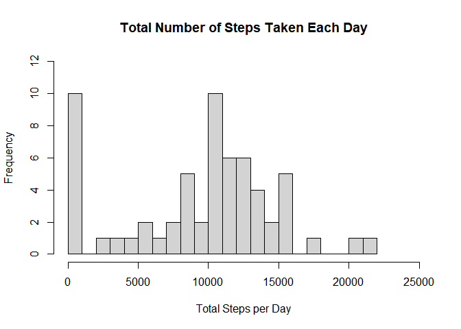
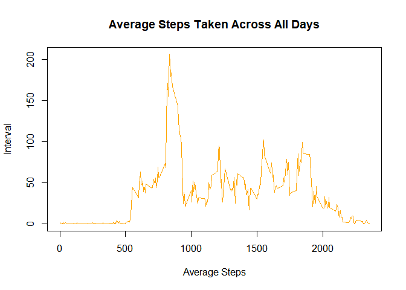
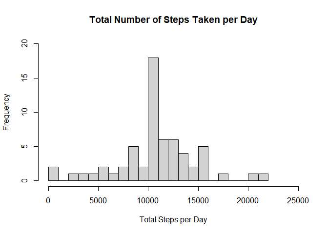
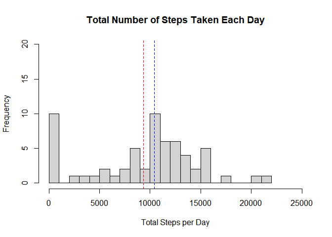
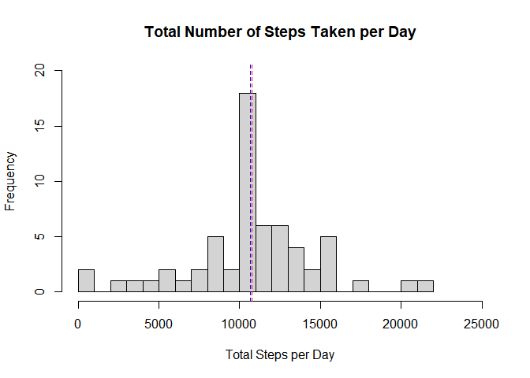
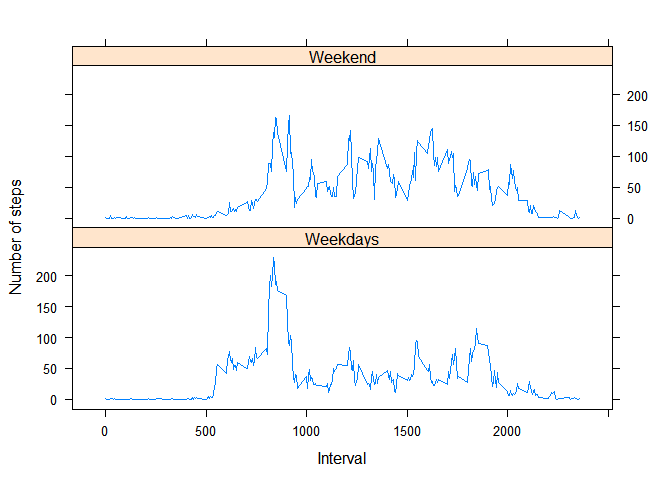

## Loading and preprocessing the data

```r
        data <- read.csv("activity.csv", header = TRUE)
        data$date  <- as.Date(data$date,"%Y-%m-%d")
```


## What is mean total number of steps taken per day?

```r
        library(dplyr)
```

```
## 
## Attaching package: 'dplyr'
```

```
## The following objects are masked from 'package:stats':
## 
##     filter, lag
```

```
## The following objects are masked from 'package:base':
## 
##     intersect, setdiff, setequal, union
```

```r
# calculate the total number of steps taken per day
        data_per_day <- select(data, steps, date, interval ) %>% 
                group_by (date) %>% 
                summarize(steps_per_day = sum(steps, na.rm = TRUE))
```

```
## `summarise()` ungrouping output (override with `.groups` argument)
```

```r
# histogram of the total number of steps taken each day 
        hist(data_per_day$steps_per_day, 
             main = 'Total Number of Steps Taken Each Day', 
             xlab = 'Total Steps per Day',
             breaks = 20,
             xlim = c(0,25000),
             ylim = c(0, 12))
```

<!-- -->

```r
# calculate and report the mean and median of the total number of steps taken per day 

        mean <- mean(data_per_day$steps_per_day)
        median <- median(data_per_day$steps_per_day)
```
    
    The mean number of steps taken each day is 9354 and the median number of steps taken each day is 1.0395\times 10^{4}.    
        
        
## What is the average daily activity pattern?


```r
# average steps by interval 
        data_by_interval <- select(data, steps, date, interval) %>%
                        group_by(interval)%>% 
                        summarize(avg_steps = mean(steps, na.rm = TRUE))
```

```
## `summarise()` ungrouping output (override with `.groups` argument)
```

```r
# time series plot      
        plot(x=data_by_interval$interval, 
             y=data_by_interval$avg_steps, 
             type = "l",
             main = "Average Steps Taken Across All Days", 
             xlab = "Average Steps", 
             ylab = "Interval", 
             col = "orange")
```

<!-- -->

```r
# maximum number of steps taken 
        max_steps <- max(data_by_interval$avg_steps)
        max_interval <- data_by_interval[data_by_interval$avg_steps == max_steps,]
        max_interval_nb <- max_interval$interval
```

        On average across all the days in the dataset, 835 contains the maximum number of steps. 
        
        
## Imputing missing values


```r
# calculate and report the total number of missing values in the dataset
        missing <- sum(!complete.cases(data))
        cat("Number of Rows with Missing Values =", as.character(missing))
```

```
## Number of Rows with Missing Values = 2304
```

```r
# filling in all of the missing values with the mean for that 5-minute interval 
        interval_mean <- as.data.frame(data_by_interval)
        data_mod <- data
        
        for (i in 1:nrow(data_mod)) {
                if (is.na(data_mod$steps[i])){
                        n <- interval_mean[interval_mean$interval == data_mod$interval[i], "avg_steps"]
                        data_mod$steps[i] <- as.integer(round(n,4))
                }
        }

        
# histogram of total number of steps taken each day 
        data_mod_day <- select(data_mod, steps, date) %>% 
                        group_by(date) %>% 
                        summarize(steps_per_day = sum(steps))
```

```
## `summarise()` ungrouping output (override with `.groups` argument)
```

```r
        hist(data_mod_day$steps_per_day, 
             main = "Total Number of Steps Taken per Day",
             xlab = "Total Steps per Day", 
             xlim = c(0, 25000), 
             ylim = c(0, 20), 
             breaks = 20)
```

<!-- -->

```r
# calculate and report the mean and median total number of steps taken per day
        mean_mod <- mean(data_mod_day$steps_per_day)
        median_mod <- median(data_mod_day$steps_per_day)
        
        
# does the values differ from the estimate from the first part of the assignment 
        mean_check <- mean == mean_mod
        median_check <- median == median_mod

        
# what is the impact of imputing missing data on the estimates of the total daily number of steps 
        mean_change <- (mean_mod/mean -1) *100 
        median_change <- (median_mod/median - 1) * 100

        hist(data_per_day$steps_per_day, 
             main = 'Total Number of Steps Taken Each Day', 
             xlab = 'Total Steps per Day',
             breaks = 20,
             xlim = c(0,25000),
             ylim = c(0, 20))
        abline( v = mean, lwd = 1, lty = 2, col = "red")
        abline( v = median, lwd = 1, lty = 2, col = "blue")
```

<!-- -->

```r
        hist(data_mod_day$steps_per_day, 
             main = "Total Number of Steps Taken per Day",
             xlab = "Total Steps per Day", 
             xlim = c(0, 25000), 
             ylim = c(0, 20), 
             breaks = 20)
        abline( v = mean_mod, lwd = 1, lty = 2, col = "red")
        abline( v = median_mod, lwd = 1, lty = 2, col = "blue")
```

<!-- -->
        
        After filling missing value with the average for the interval, mean total number of steps taken per day is different from the estimate without filling missing value: FALSE and median total number of steps taken per day is different from the estimate without filling missing value: FALSE. 
        
        with imputed missing value, the average steps taken per day is changed by 14.92 percent and median is changed by 2.37 percent.
        
 
 
## Are there differences in activity patterns between weekdays and weekends?


```r
        data_mod$dayofweek <- as.factor(weekdays(data_mod$date))
        
        data_mod$week <- ifelse(data_mod$dayofweek %in% ("Saturday"), "Weekend", 
                                ifelse(data_mod$dayofweek %in% ("Sunday"), "Weekend", "Weekdays"))
        
        data_mod_sum <- data_mod %>% 
                        group_by (week,interval) %>% 
                        summarize(avg_steps = mean(steps))
```

```
## `summarise()` regrouping output by 'week' (override with `.groups` argument)
```

```r
        library(lattice)
        xyplot(data_mod_sum$avg_steps ~ data_mod_sum$interval|data_mod_sum$week,
             data = data_mod_sum,
             type = "l", 
             layout = c(1:2),
             xlab = "Interval", 
             ylab = "Number of steps", 
             color = "blue")
```

<!-- -->


